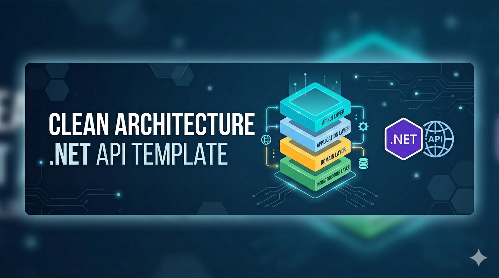

[](https://github.com/MarceloDanielToledo/CleanArchitectureTemplate/blob/main/README.es.md)
[](https://dotnet.microsoft.com)
[](LICENSE)

# Clean Architecture Template 



This repository provides a starting point for developing APIs in .NET following the principles of **Clean Architecture**. Designed to be modular, scalable, and easy to maintain, this template facilitates the development of robust and well-structured applications.

## Why this template?

A practical, framework-light Clean Architecture starter designed to fit any team.
Every pattern is explicit and implemented manually — no hidden magic, no mandatory
conventions, easy to adapt to your team's needs from day one.

---

## Domain Context

The management of orders was designed with a clear and simple structure:

- **Orders**: Represent a transaction that groups one or more items.
- **Items**: These are specific products within an order, indicating quantity and unit price.
- **Products**: Contain basic information about available items, such as name, description, and price. *The application performs a seed during initialization to load 10 products.

```csharp
public class SeedData
{
    public static async Task InitializeDataAsync(IServiceProvider serviceProvider)
    {
        await SeedProducts.Seed(serviceProvider);
    }
}
```

---

## 🛠️ Features

- **Zero magic CQRS** — commands and queries wired by hand, no dependency on external libraries.
- **Validation as a decorator** — `ValidatingCommandHandler<,>` runs all FluentValidation rules before any handler executes.
- **No external mapping libraries** — static extension methods (`ToEntity()`, `ToResponse()`) you can read and debug directly.
- **Auto-migration & seeding** — the app migrates the database and seeds 10 sample products on every startup.
- **Centralized error handling** — `ErrorHandlerMiddleware` maps all exceptions to consistent HTTP responses.
- **`IEntityTypeConfiguration`** — each entity's EF Core config lives in its own class (Single Responsibility).
- **Generic response wrapper** — every endpoint returns `Response<T>` with `Succeeded`, `Message`, `Errors[]`, and `Data`.
- **RESTful routing** — routes follow REST conventions (`api/v{version}/[controller]`).

---

## Prerequisites

- [.NET 9 SDK](https://dotnet.microsoft.com/download/dotnet/9.0)
- SQL Server or SQL Server Express — **or Docker** (see below)

## Getting Started

### Local

```bash
git clone https://github.com/MarceloDanielToledo/CleanArchitectureTemplate.git
cd CleanArchitectureTemplate
dotnet restore
dotnet run --project src/Presentation/WebAPI/WebAPI.csproj
```

The API auto-migrates the database and seeds 10 sample products on first run.
Scalar UI is available at `http://localhost:{port}/scalar/v1`.

### Docker

```bash
docker-compose up --build
```

This starts the API and a SQL Server 2022 instance. No local SQL Server installation required.

| Service | URL |
|---------|-----|
| API | `http://localhost:8080` |
| Scalar UI | `http://localhost:8080/scalar/v1` |

**Stop:**
```bash
docker-compose down
```

**Stop and remove data:**
```bash
docker-compose down -v
```

---

## 🏗️ Project Structure

```plaintext
📂 src
 ├── 📁 Core
 │    ├─ 📘 Application
 │    ├─ 📘 Domain
 ├── 📁 Infraestructure
 │    ├─ 📘 Repository
 ├── 📁 Presentation
 │    ├─ 📘 WebAPI
 └── 📁 Shared
      ├─ 📘 Shared
📂 tests
 ├── 📁 Core
 │    ├─ ✅ Application.UnitTests
 ├── 📁 Infraestructure
 │    ├─ ✅ Repository.UnitTests
 ├── 📁 Presentation
 │    ├─ ✅ Presentation.IntegrationTests
 └── 📁 Shared
```

---

### Domain

Defines the business model with completely "anemic" entities, meaning they do not contain validations or behaviors. This allows validations and business logic to be managed in the upper layer (Application).

### Application

Contains business logic specific to each use case, defining validations, mappings, DTOs, API interfaces, exceptions, commands, and queries.

### Repository

Defines any type of persistence, which could be a database, files, etc. This layer implements the interface responsible for input and output operations.

### WebAPI

The outermost layer that communicates the application with the external world. It defines endpoints, the _ErrorHandlerMiddleware_, and adds services from all layers via extension methods.

### Shared

Contains shared code between layers that doesn't belong to any specific one, such as services, utility classes, etc.

---

## ✅ Tests

**Application**: Unit tests instantiate handlers directly (no DI, no external libraries). Repositories are mocked with Moq. Each command handler has at least one success and one failure test.

See [`tests/Core/Application.UnitTests`](tests/Core/Application.UnitTests) for examples.

**Repository**: Tests use `Microsoft.EntityFrameworkCore.InMemory` — no mocks, real EF Core behavior against an in-memory database.

See [`tests/Infraestructure/Repository.UnitTests`](tests/Infraestructure/Repository.UnitTests) for examples.

**Presentation** (Integration): Uses `WebApplicationFactory<Program>` to spin up the real application stack in-process. The database is replaced with an in-memory provider — no external SQL Server required. State is reset between tests via `EnsureDeleted` + `EnsureCreated`.

See [`tests/Presentation/Presentation.IntegrationTests`](tests/Presentation/Presentation.IntegrationTests) for examples.

---

## Libraries Used

| Library | Purpose |
|---------|---------|
| Entity Framework Core | ORM and database migrations |
| Ardalis.Specification | Repository query specifications |
| FluentValidation | Command input validation |
| Asp.Versioning.Mvc | API versioning |
| Microsoft.AspNetCore.OpenApi | Native OpenAPI document generation (.NET 9) |
| Scalar.AspNetCore | Interactive API documentation UI |
| Serilog | Structured logging |
| Moq | Mocking for unit tests |
| xUnit | Unit test framework |
| Microsoft.EntityFrameworkCore.InMemory | In-memory database for testing |

---

## Contributing

Contributions are welcome! Fork the repository, create a feature branch, and open a pull request.

## License

This project is licensed under the MIT License. See the [`LICENSE`](LICENSE) file for details.
